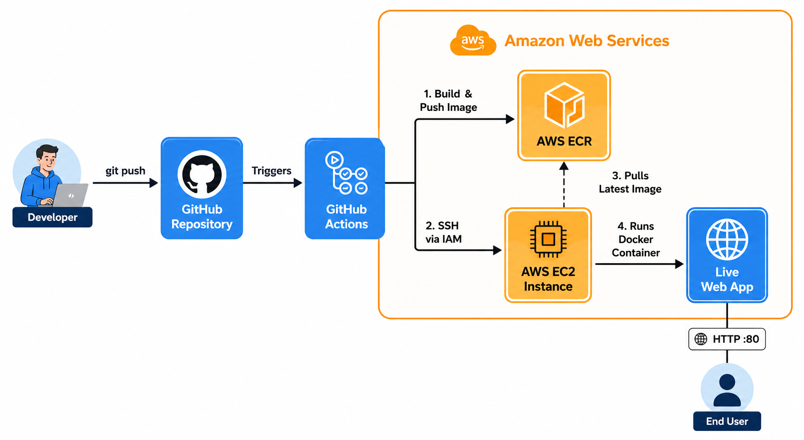
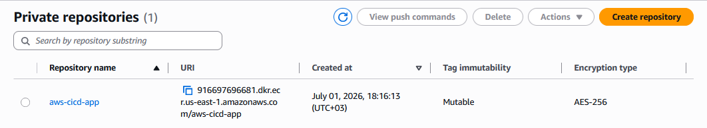
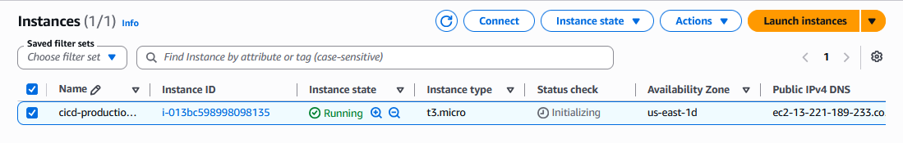
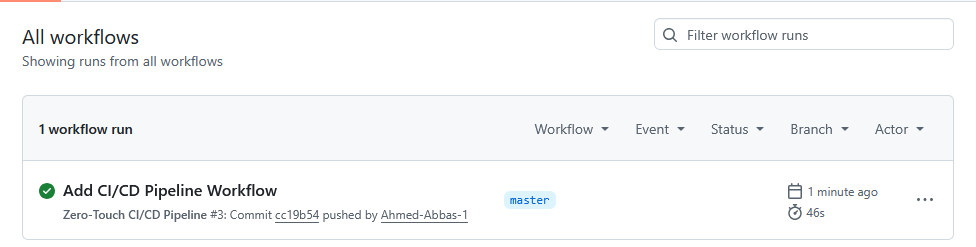
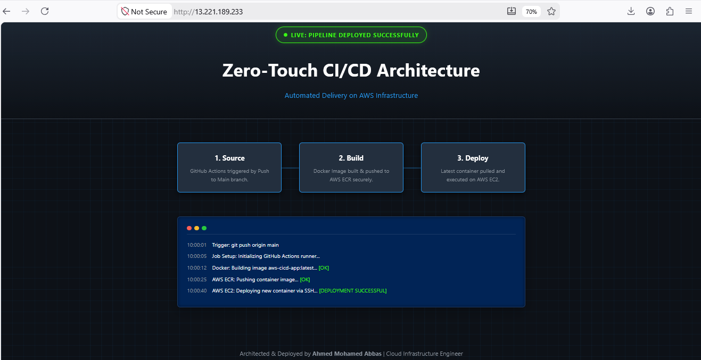

<div align="center">

# 🚀 Zero-Touch CI/CD Pipeline on AWS


<br>
</div>

## 📖 1. Project Overview
This project demonstrates the implementation of a **Zero-Touch Continuous Integration and Continuous Deployment (CI/CD) Pipeline**. It automates the entire software delivery lifecycle—from code commit to production deployment—eliminating manual intervention. By leveraging GitHub Actions, Docker, and AWS native services (ECR & EC2), the pipeline ensures rapid, reliable, and consistent application delivery.

---

## 🏛️ 2. Architecture Diagram
The architecture illustrates the seamless flow of code transitioning into a running cloud-based container.

<p align="center">
  
  <br>
  <em><b>Figure 1:</b> System Architecture Diagram </em>
</p>

---

## 🧰 3. Technology Stack

* **CI/CD Automation (GitHub Actions):** Orchestrating the build, push, and deployment workflows securely and seamlessly.
* **Containerization (Docker):** Packaging the application and its environment into a standard, lightweight, and portable unit.
* **Container Registry (AWS ECR):** Providing a secure, highly available repository for storing and managing private Docker container images.
* **Compute & Hosting (AWS EC2):** Serving as the reliable production host infrastructure to execute the containerized application.
* **Security & Identity (AWS IAM):** Enforcing strict security protocols and providing least-privilege programmatic access for GitHub Actions to interact with AWS resources.

---

## 📂 4. Repository Structure

```text
aws-zero-touch-cicd/
├── .github/workflows/
│   └── deploy.yml        # The core CI/CD pipeline automation script
├── images/               # Execution and verification screenshots
│   ├── 1-aws-ecr-repo.png
│   ├── 2-aws-ec2-running.png
│   ├── 3-github-actions-success.png
│   ├── 4-live-web-app.png
│   └── project-diagram.png
├── Dockerfile            # Instructions to build the application container image
├── index.html            # The web application source code (Live Status UI)
└── README.md             # Detailed project documentation (This file)

```
## 📋 Prerequisites
Before deploying this architecture or replicating this project, ensure you have the following in place:
* **AWS Account:** An active Amazon Web Services account with permissions to provision EC2 instances, manage ECR repositories, and create IAM users.
* **GitHub Account:** A repository to host the source code, configure repository secrets, and execute GitHub Actions.
* **Local Git Environment:** Git installed locally to track code changes and push them to the remote repository.
* **Fundamental Knowledge:** Basic familiarity with Docker containerization, Linux command line, and cloud networking concepts.

## ⚙️ 5. Step-by-Step Execution Guide

**Step 1: Application Containerization**
* Authored a `Dockerfile` utilizing `nginx:alpine` to serve as a lightweight, secure web server for the application.
* Defined the local build context and configured the container to serve the static HTML assets securely.

**Step 2: AWS Infrastructure Provisioning**
* **Container Registry:** Provisioned a private AWS ECR repository (`aws-cicd-app`) to securely host and manage the built Docker images.
* **Compute Engine:** Launched an AWS EC2 `t3.micro` instance running Ubuntu 24.04. Configured Security Groups strictly allowing HTTP (Port 80) for web traffic and SSH (Port 22) for deployment access.
* **Identity & Access (IAM):** Generated AWS IAM credentials (`Access Key` & `Secret Key`) equipped with least-privilege policies to allow programmatic interaction between GitHub and AWS.

**Step 3: GitHub Secrets Configuration**
* Secured all sensitive infrastructure data by injecting them as GitHub Actions Repository Secrets (including `AWS_ACCESS_KEY_ID`, `EC2_SSH_KEY`, `EC2_HOST`, and `ECR_REPOSITORY`).

**Step 4: CI/CD Pipeline Orchestration**
* Developed the `.github/workflows/deploy.yml` pipeline to automatically trigger upon any push to the `master` or `main` branches.
* **Build Phase:** The GitHub runner authenticates with AWS ECR, builds the Docker image from the latest code, tags it, and pushes it to the private registry.
* **Deploy Phase:** The pipeline securely SSHs into the EC2 instance, dynamically installs AWS CLI v2, authenticates Docker with ECR, pulls the newly tagged image, and runs the updated container while gracefully terminating the outdated one.

---
## 🚀 6. Implementation Stages & Verification

### Stage 1: Cloud Registry Provisioning (AWS ECR)
Created a secure, private Elastic Container Registry to store the Docker images generated by the CI pipeline.
<p align="center">
  
  <br>
  <em><b>Figure 2:</b> AWS ECR private repository successfully provisioned and ready to store container images.</em>
</p>

### Stage 2: Production Server Setup (AWS EC2)
Launched an Ubuntu-based EC2 instance, configured Security Groups to allow HTTP (80) and SSH (22) traffic, and initialized the host environment.
<p align="center">
  
  <br>
  <em><b>Figure 3:</b> EC2 production server initialized and actively running in the AWS console.</em>
</p>

### Stage 3: Zero-Touch Pipeline Execution (GitHub Actions)
Configured the `.yml` workflow with AWS IAM secrets. The pipeline automatically triggered upon code push, executed the Docker build, pushed to ECR, and securely SSH'd into the EC2 instance to deploy the latest container.
<p align="center">
  
  <br>
  <em><b>Figure 4:</b> Successful CI/CD workflow run demonstrating complete zero-touch delivery.</em>
</p>

### Stage 4: Live Deployment Verification
The application is live, pulling the latest configurations via the automated Docker container directly from the ECR registry.
<p align="center">
  
  <br>
  <em><b>Figure 5:</b> The live, containerized web application successfully responding to public internet traffic.</em>
</p>

---

## ⚠️ 7. Challenges Encountered & Solutions

* **Challenge:** The `Deploy to EC2` job failed because the `aws` CLI command was not recognized on the raw Ubuntu production instance.
  * **Solution:** Enhanced the deployment script within `deploy.yml` to automatically update packages and install `unzip` and `curl`, then downloaded and installed the official `awscli-exe-linux-x86_64` bundle on the fly prior to executing ECR authentication.

---

## 🔭 8. Future Enhancements

* **Domain & SSL Integration:** Integrating AWS Route 53 for custom domain routing and AWS Certificate Manager (ACM) to enforce secure HTTPS encryption.
* **Advanced Orchestration:** Migrating the compute layer from a standalone EC2 instance to an AWS ECS Cluster or AWS EKS (Elastic Kubernetes Service) for higher availability and resilience.
* **Infrastructure as Code (IaC):** Using Terraform to provision the ECR repository, EC2 instances, and IAM roles automatically instead of manual AWS Console setup.
---
## 🤝 9. Acknowledgments

Special thanks to the **AWS**, **Docker**, and **GitHub Actions** open-source communities for providing the robust tools, registries, and documentation that make modern DevOps and Cloud Infrastructure Engineering possible.
<br>
<hr>
<div align="center">
  <h3>🏗️ Architected & Deployed by</h3>
  <h2>Ahmed Mohamed Abbas Bahij</h2>
  <p><b>Cloud Infrastructure & DevOps Engineer</b></p>
  
  <a href="https://www.linkedin.com/in/ahmedabbas99" target="_blank">
    
  </a>
</div>
<hr>
